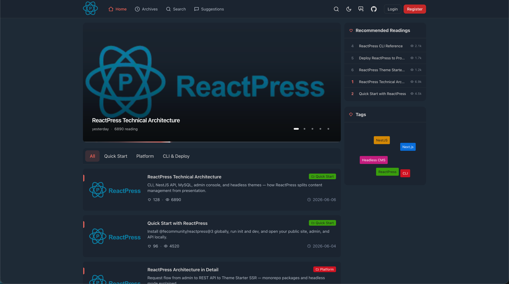
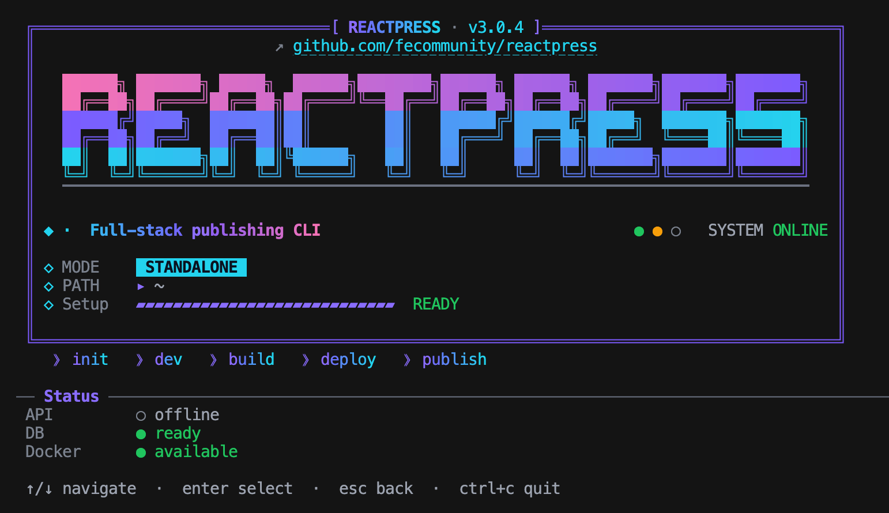

<div align="center">

<a href="https://reactpress.surge.sh/">
  
</a>

<br />

**ReactPress Theme Starter**

A lightweight, simple, and easy-to-use Next.js theme, powered by [ReactPress](https://github.com/fecommunity/reactpress).

<a href="https://reactpress-theme-starter.vercel.app">
  
</a>

<br />

[Live Demo](https://reactpress-theme-starter.vercel.app) · [Documentation](https://reactpress.surge.sh/) · [简体中文](./README_zh.md)

<br />


<a href="https://github.com/fecommunity/reactpress-theme-starter/stargazers">
  
</a>

<br />

**If this project helps you, a ⭐ on GitHub helps others discover it.**

</div>

---

## Try in 60 seconds (no backend)

Preview the full theme UI with built-in sample data — no ReactPress install required.

### Option A — `create-next-app` (recommended)

Bootstrap from this repository with the [official Next.js CLI](https://nextjs.org/docs/app/api-reference/cli/create-next-app):

```bash
npx create-next-app@latest reactpress-theme-starter --example "https://github.com/fecommunity/reactpress-theme-starter" --use-pnpm
cd reactpress-theme-starter
pnpm dev:mock
```

### Option B — clone manually

```bash
git clone https://github.com/fecommunity/reactpress-theme-starter.git
cd reactpress-theme-starter
pnpm install
pnpm dev:mock
```

Open **http://localhost:3001** — same mode as the [live demo](https://reactpress-theme-starter.vercel.app).

### Deploy to Vercel (zero env vars)

One-click deploy uses [`vercel.json`](./vercel.json) with mock data — no backend required.

[](https://vercel.com/new/clone?repository-url=https%3A%2F%2Fgithub.com%2Ffecommunity%2Freactpress-theme-starter&project-name=reactpress-theme&repository-name=reactpress-theme&demo-title=ReactPress%20Theme%20Starter&demo-description=Next.js%2015%20headless%20blog%20theme%20with%20mock%20mode%20%E2%80%94%20no%20backend%20required&demo-url=https%3A%2F%2Freactpress-theme-starter.vercel.app&demo-image=https%3A%2F%2Fraw.githubusercontent.com%2Ffecommunity%2Freactpress-theme-starter%2Fmaster%2Fpublic%2Fhome-dark.png)

---

## What is this?

This repository is the **public-facing theme** for ReactPress: routing, layout, SEO, and UI. It does **not** include a CMS or admin panel — all content comes from a ReactPress backend via [`@fecommunity/reactpress-toolkit`](https://www.npmjs.com/package/@fecommunity/reactpress-toolkit).

```text
ReactPress API  ──REST──▶  Theme Starter (Next.js)  ──▶  Public Site
```

**Stack:** Next.js 15 · React 19 · Tailwind CSS 4 · Node.js 20+ · pnpm 9

**Includes:** articles, archives, search, CMS pages, knowledge base, comments, light/dark mode, RSS/sitemap, and an optional embedded mock API for offline development.

### Why this theme?

|                           | ReactPress Theme Starter                                                 | Generic Next.js blog template |
| :------------------------ | :----------------------------------------------------------------------- | :---------------------------- |
| CMS & admin               | ✅ [ReactPress](https://github.com/fecommunity/reactpress) backend + CLI | ❌ Build or wire your own     |
| Try without backend       | ✅ `pnpm dev:mock`                                                       | ❌ Usually needs content/API  |
| Knowledge base & comments | ✅ Built-in                                                              | ❌ Roll your own              |
| Customizable appearance   | ✅ Admin console + `theme.json`                                          | ❌ Hard-coded or manual       |
| Lighthouse performance    | ✅ **95** out of the box (see below)                                     | ❌ Varies widely              |

### Performance

Built on Next.js 15 App Router with server rendering, static generation, and minimal client JavaScript — the theme delivers strong Core Web Vitals without extra tuning.

<div align="center">


</div>

| Category       | Score   |
| :------------- | :------ |
| Performance    | **95**  |
| Accessibility  | **100** |
| Best Practices | **100** |
| SEO            | **100** |

**Core Web Vitals** (homepage audit on the [live demo](https://reactpress-theme-starter.vercel.app)):

| Metric                         | Result     |
| :----------------------------- | :--------- |
| First Contentful Paint (FCP)   | **0.4 s**  |
| Largest Contentful Paint (LCP) | **1.0 s**  |
| Total Blocking Time (TBT)      | **150 ms** |
| Cumulative Layout Shift (CLS)  | **0**      |
| Speed Index                    | **1.1 s**  |

**Why it feels fast:**

- **SSR + SSG** — pages render on the server; static routes are pre-built at deploy time
- **Zero layout shift** — stable typography and layout from first paint
- **Light client bundle** — content-first UI without heavy runtime overhead
- **SEO-ready** — metadata, Open Graph, RSS, and sitemap included

---

## Quick Start

**Requirements:** Node.js 20+, pnpm 9+

### Recommended — ReactPress CLI

The fastest way to run a full stack (visitor site, admin console, and API) is the [ReactPress CLI](https://reactpress.surge.sh/). No manual `.env` wiring for a standard setup.

```bash
npm i -g @fecommunity/reactpress@3
reactpress init
reactpress dev
```

<div align="center">



</div>

After startup, open the URLs printed in the terminal (typically the public site, admin, and API). Use `reactpress doctor` if something fails to start.

**Use this theme with the CLI**

1. Clone this repository and install dependencies (`pnpm install`).
2. Start the API with `reactpress dev --api-only` (or run the full stack and point the theme at the API).
3. Copy [`.env.example`](./.env.example) to `.env` if needed — default local API is `http://localhost:3002/api`.
4. In the theme directory, run:

```bash
pnpm dev
```

Open **http://localhost:3001** — the theme loads live content from your ReactPress API.

Remote API during development:

```bash
pnpm dev -- --remote-origin api.yoursite.com
```

### Local theme preview (mock — no backend)

To work on UI, layout, or styling **without** installing ReactPress or running the API, use the built-in mock server:

```bash
git clone https://github.com/fecommunity/reactpress-theme-starter.git
cd reactpress-theme-starter
pnpm install
pnpm dev:mock
```

Open **http://localhost:3001** — sample data comes from [`lib/mock-api/data.ts`](./lib/mock-api/data.ts). This is the same mode used by the [Vercel demo](https://reactpress-theme-starter.vercel.app).

---

## Commands

| Command              | Purpose                                                       |
| :------------------- | :------------------------------------------------------------ |
| `pnpm dev`           | Theme dev server + live ReactPress API (CLI or remote)        |
| `pnpm dev:mock`      | Theme dev server + built-in mock API (no backend)             |
| `pnpm build:mock`    | Production build with mock data (Vercel demo / offline build) |
| `pnpm build`         | Production build (API must be reachable at build time)        |
| `pnpm start`         | Run production server on port **3001**                        |
| `pnpm run check`     | ESLint + Prettier                                             |
| `pnpm run typecheck` | TypeScript check                                              |

For full-stack local development (site + admin + API), prefer **`reactpress dev`** from the ReactPress CLI — see [Quick Start](#quick-start).

---

## Configuration

When using **`pnpm dev`** against a live API, copy [`.env.example`](./.env.example) to `.env`. Mock mode (`pnpm dev:mock`) and the ReactPress CLI handle most setup for you.

| Variable                         | Description                                     |
| :------------------------------- | :---------------------------------------------- |
| `REACTPRESS_API_URL`             | Server-side API base URL (include `/api`)       |
| `NEXT_PUBLIC_REACTPRESS_API_URL` | Client-side API URL; use `/api` for same-origin |
| `CLIENT_SITE_URL`                | Public site URL for SEO and Open Graph          |
| `REACTPRESS_MOCK_API`            | Set to `1` to enable the embedded mock API      |

See `.env.example` for optional variables (subpath deploy, GitHub OAuth, remote dev origin).

---

## Deployment

### Demo (Vercel)

Import this repo as-is — [`vercel.json`](./vercel.json) uses `build:mock` with mock data. See [Deploy to Vercel](#deploy-to-vercel-zero-env-vars) above for the one-click button with live demo preview.

> The [live demo](https://reactpress-theme-starter.vercel.app) runs in mock mode (UI + sample data only).

### Production

Deploy as a headless frontend pointed at your ReactPress API:

1. Set `REACTPRESS_API_URL`, `NEXT_PUBLIC_REACTPRESS_API_URL`, and `CLIENT_SITE_URL`
2. Build with `pnpm build` (not `build:mock`)
3. Start with `pnpm start` or your platform's Next.js runtime

`pnpm build` prefetches pages from the API — ensure the API is reachable at build time.

---

## Project Layout

```text
app/           App Router pages, feeds, sitemap, mock API route
components/    Layout, article, search, widgets
lib/           mock-api/, reactpress/ utilities
scripts/       dev, build, and smoke-test scripts
theme.json     Theme manifest (routes, appearance schema)
```

Route templates are declared in [`theme.json`](./theme.json). Appearance (colors, logo, navigation) is configured in the ReactPress admin console.

---

## FAQ

<details>
<summary><strong>Do I need ReactPress to preview the theme?</strong></summary>

No. Run `pnpm dev:mock` for a full UI preview with sample data. Install [ReactPress CLI](https://reactpress.surge.sh/) when you want a real CMS, admin panel, and API.

</details>

<details>
<summary><strong>How is this different from WordPress or Ghost themes?</strong></summary>

This is a **headless frontend** — content lives in ReactPress (REST API + admin). You deploy the Next.js theme separately and point it at your API. See [ReactPress docs](https://reactpress.surge.sh/) for the full stack.

</details>

<details>
<summary><strong>Can I use my own Next.js components or fork the theme?</strong></summary>

Yes. MIT licensed. Customize components under `app/` and `components/`, or declare routes in [`theme.json`](./theme.json). Pull requests welcome — see [Contributing](./CONTRIBUTING.md).

</details>

<details>
<summary><strong>Where do I report bugs in the CMS or CLI?</strong></summary>

Theme issues → [this repo](https://github.com/fecommunity/reactpress-theme-starter/issues). Core ReactPress (API, admin, CLI) → [fecommunity/reactpress](https://github.com/fecommunity/reactpress/issues).

</details>

---

## Community

| Channel         | Link                                                                                      |
| :-------------- | :---------------------------------------------------------------------------------------- |
| Q&A & showcase  | [GitHub Discussions](https://github.com/fecommunity/reactpress-theme-starter/discussions) |
| Bug reports     | [Issues](https://github.com/fecommunity/reactpress-theme-starter/issues)                  |
| ReactPress core | [github.com/fecommunity/reactpress](https://github.com/fecommunity/reactpress)            |
| Documentation   | [reactpress.surge.sh](https://reactpress.surge.sh/)                                       |

---

## Contributing

|                                             |                                   |
| :------------------------------------------ | :-------------------------------- |
| [Contributing](./CONTRIBUTING.md)           | Setup, conventions, pull requests |
| [Contributing (中文)](./CONTRIBUTING_zh.md) | 中文贡献指南                      |
| [Code of Conduct](./CODE_OF_CONDUCT.md)     | Community standards               |
| [Security](./SECURITY.md)                   | Report vulnerabilities            |

---

## Links

|                   |                                                                                                  |
| :---------------- | :----------------------------------------------------------------------------------------------- |
| ReactPress docs   | [reactpress.surge.sh](https://reactpress.surge.sh/)                                              |
| ReactPress source | [github.com/fecommunity/reactpress](https://github.com/fecommunity/reactpress)                   |
| Toolkit           | [@fecommunity/reactpress-toolkit](https://www.npmjs.com/package/@fecommunity/reactpress-toolkit) |
| Theme schema      | [theme.manifest.schema.json](./theme.manifest.schema.json)                                       |

<br />

<div align="center">

[MIT License](./LICENSE) · © ReactPress / FECommunity

</div>
